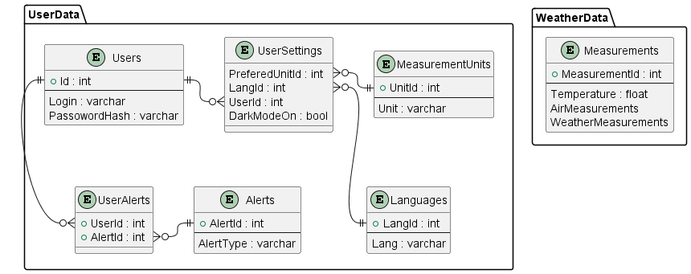

### Database model

Model of our database is presented on the image below. 
The source code for this image can be found in ``./db_model/db-model.puml``.

Problems:
- We are going to need to specify what kind of units we want to keep track of.
- We need to specify what kind of measurements we need in this table.